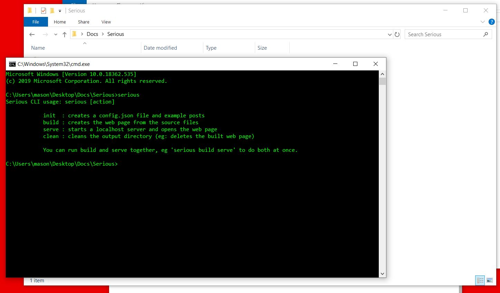

## Introduction

This is a guide to using Serious for authors. It assumes you have little knowledge of programming and just want to make a serial fiction story. We'll cover the following things:

- [Installing Serious](#installation)
- [Configuring Your Story](#configuration)
- [Writing Your First Episode](#writing-your-first-episode)
- [Adding Links and Additional Pages](#adding-links-and-additional-pages)
- [Publishing Your Website](#publishing)

Serious can be a bit intimidating, and may not be for every author or every project, but if you want more control over your content and how your readers interact with it, you'll hopefully find this tool useful.

## Installation

Go [here](https://github.com/ChapelR/serious-npm/releases), find the latest release, and download the appropriate zip file for your operating system under "assets." Once you have the file, unzip it. The only thing you really need is the `serious.exe` file (on Windows, on other systems, the file extension may be different).

Create a new folder where you want to make your story. Make sure the folder is empty. Drop the `serious.exe` file into it. You'll now need to open a command window in that folder. The easiest way to do that on a Windows machine is to press `Alt + D`, type `CMD` and then press `enter`.


In the terminal, type `serious` and press `enter`. You should see the program's basic instructions, like so:



If you see that, you did things right. Serious is installed and ready to go! If you get an error, like one saying `'serious' is not a recognized command` or something similar, check to make sure the path in the command line&mdash;`C:\Users\...` is pointing at the correct directory. If it isn't, type `cd`, the correct path, then press `enter` and try again (for example: `cd C:\users\myname\Desktop\My Story`).

Now you can set up your new Serious project. Type `serious init` into the terminal and press `enter`. Your default browser should open, showing the example story. If you look back at the folder, it should now look like this:


If you see something similar to this, then Serious is installed and your new project is started!

> For the more experienced:
>
> Serious can also be installed via NPM with this command: `npm i -g serious-fiction` which will immediately give you access to the same CLI as described above.
>
> If you go with the executable installation, you can also add the executable file to your `PATH` environment variable on your operating system if you want.

## Configuration

The `config.json` file at root of your project's folder is very important--using this file you'll be able to change some of Serious' basic settings, like your story's title, subtitle (if any), description, and copyright info. You can also use this file to make use of many of Serious' built-in features. For example, you can use set the `"nsfw"` option to `true` and Serious will automatically display an age gate for your story. You can set the `"googleAnalytics"` option to a valid Google Analytics tracking ID to add analytics to your project. You can set up a [Disqus](https://disqus.com/) comment system and simply plug in the shortname to enable comments.

To edit the configuration settings, open the file in any **text editor** (important: don't open the file in a word processor). Please be careful with the quotes and commas, JSON files require specific syntax to work.

> Examples of text editors:
>
> - [Windows Notepad](https://www.microsoft.com/en-us/p/windows-notepad/9msmlrh6lzf3)
> - [TextEdit (Mac)](https://support.apple.com/guide/textedit/open-documents-txte51413d09/mac)
> - [Sublime Text](https://www.sublimetext.com/)
> - [Atom](https://atom.io/)
> - [VS Code](https://code.visualstudio.com/)
> - [Notepad++](https://notepad-plus-plus.org/)
> - [Brackets](http://brackets.io/)
>
> And dozens of similar apps that can edit plain text files.

For a complete breakdown, see the [documentation](https://twinelab.net/serious/#/?id=configuration). For now, you'll want to edit the title, description, and copyright at least.

## Writing Your First Episode

Now it's finally time to write!

Serious uses [markdown](https://www.markdownguide.org/), a simple but powerful markup language used all across the web. If you've ever written a GitHub readme or a post on Reddit, you've used markdown. Even if you haven't, markdown is quick and easy to get the hang of. You won't be able to write markdown files in a normal word processor, but there are several great markdown editors out there, and any text or code editor can also work. If you need recommendations, check these out:

- [Typora](https://www.typora.io/)
- [iA Writer](https://ia.net/writer)
- [Dillinger](https://dillinger.io/)

You'll create a new markdown file with the `.md` file extension in the `src` folder. You can name the file whatever you want. There will be an `example.md` file already in this folder if you need to look at it, and you can refer to the detailed documentation [here](https://twinelab.net/serious/#/?id=writing-episodes) if you need it.

When you start writing your episode, you'll first create a block at the very top of your file for *metadata*. These blocks are commonly called *frontmatter*. You'll put three dashes on the first line of the file, your metadata, then three more dashes:

```markdown
---
title: My First Episode
episode: 1
---
```

The metadata is provided as a list of key/value pairs. Each pair goes on its own line. Every episode you make **must** have both a `title` and an `episode` value, the latter of which should be a number&mdash;specifically a positive integer. You can also have a `subtitle` and a `description` if you want; neither is required, but the `description` is recommended.

After the frontmatter, you will write your episode using markdown for formatting.<div class='wrap'>

```markdown
---
title: My First Episode
episode: 1
---
Call me Ishmael. Some years ago--never mind how long precisely&mdash;having little or no money in my purse, and nothing particular to interest me on shore, I thought I would sail about a little and see the watery part of the world. It is a way I have of driving off the spleen, and regulating the circulation. Whenever I find myself growing grim about the mouth; whenever it is a damp, drizzly November in my soul; whenever I find myself involuntarily pausing before coffin warehouses, and bringing up the rear of every funeral I meet; and especially whenever my hypos get such an upper hand of me, that it requires a strong moral principle to prevent me from deliberately stepping into the street, and methodically knocking people's hats off&mdash;then, I account it high time to get to sea as soon as I can.

This is my substitute for pistol and ball. With a philosophical flourish Cato throws himself upon his sword; I quietly take to the ship. There is nothing surprising in this. If they but knew it, almost all men in their degree, some time or other, cherish very nearly the same feelings towards the ocean with me. There now is your insular city of the Manhattoes, belted round by wharves as Indian isles by coral reefs&mdash;commerce surrounds it with her surf.

...
```

</div>When compiled into Serious, this would render as:


You can add more episodes simply by adding more files. So to add episode 2, create another markdown file and give it `episode: 2` in the frontmatter.

Episodes must not be *sparse*. In other words, if there is an episode 1 and an episode 3, then you *must* have an episode 2 or Serious will throw an error.

## Adding Links and Additional Pages

Not everything on your Serious webpage has to be an episode; it is possible to create other posts, and to supply links for placement in the sidebar, such as to social media, your Patreon, or your personal blog. We'll start with links. Go back to `config.json` and take a look at the `"links"` section:

```
...
"links": [
    { "text": "Website", "url": "https://twinelab.net", "label": "Learn more about Serious." },
    { "text": "Blog", "url": "https://twinelab.net/blog", "label": "Visit my blog." }
],
...
```

To supply a link, simply add another entry here in the same format as the above examples, providing text, a URL, and a label. The label is optional, but highly recommended for accessibility reasons.

To add a non-episode post, called a *meta post* by Serious, go back over to the `src` folder and create a new markdown file. You can create the file in the `meta` folder to keep things nice and organized, but you do not have to.

In the frontmatter of your meta post, you'll set the `episode` property to `meta`. This is the only value the `episode` property should ever be given other than positive integers.

```markdown
---
title: About
label: Learn more...
episode: meta
---
```

The meta post will automatically be linked in the sidebar, using the post's `title` as the text of the link. 

With the above meta post and sidebar links, the sidebar should look something like this:


You can change the link text by providing a `link` property.

```markdown
---
title: About
link: Welcome
label: Learn more...
episode: meta
---
```

If you don't want the link to appear at all, set the `link` property to a single underscore (`_`) like so:

```markdown
---
title: About
link: _
episode: meta
---
```

Meta posts may also have a `description` property, like other episodes. 

As with links defined in `config.json`, it is highly recommended you include a `label` property if your meta post will be linked from the sidebar.

To learn more about meta posts, see the [docs](https://twinelab.net/serious/#/?id=meta-posts). You may want to link to specific posts, episodes or meta posts, how to do so is outlined [here](https://twinelab.net/serious/#/?id=url-scheme).

## Publishing

To view your Serious story locally, you'll open the terminal and use the command `serious build serve`. A browser window will pop up showing your story. If your story is already open in the browser, you can type `serious build` and refresh the browser to update it and reflect your changes&mdash;you may need to *hard refresh* your browser, you can generally do that with `CTRL + F5`. When you're happy with what you have and want to deploy the webpage, build it and head to the `publish` folder to see your website. Everything in this folder needs to be uploaded to your webhost to publish your Serious story.

If you don't have a webhost, [Neocities](https://neocities.org/) is a great place for novices to publish a website. We'll walk through setting up a Neocities page and deploying your story on that platform, and walk through how to make updates to it. You can use any webhost that lets you upload arbitrary HTML files. Basically, any service that isn't a blogging platform. Some site-builder style services only let you upload arbitrary HTML files if you have a premium plan (e.g. WordPress), if at all, so keep that in mind while selecting a service to use.

Sign up on the Neocities website for a free account. Once done, navigate to your site's dashboard and delete all the files. These are Neocities default starting webpage files, you don't need or want them. Upload everything in the `publish` folder. You will probably have to make each folder individually and place content in it, as you can't upload folders, but you can upload multiple files at a time, and do so through drag and drop.

Once all the files are in place, you're done, your story should be available. View it to make sure it worked.

When you go to add a new episode, you will only need to update the`content/index.json` and add any new files that aren't already present. When you make changes to your `config.json` settings, you will need to update both `index.html` and `content/index.josn`. You can add or change a [theme](https://github.com/ChapelR/serious-themes) any time by just replacing `theme.css`.